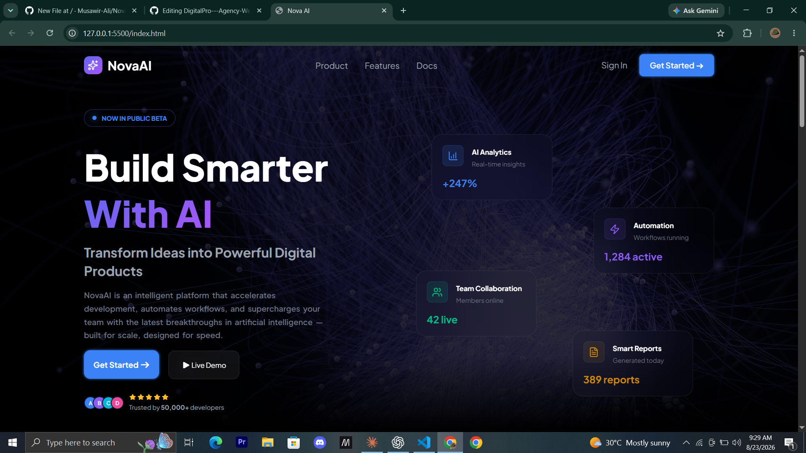

# NovaAI - AI SaaS Landing Page

A modern, fully responsive AI SaaS landing page built with HTML, CSS, and JavaScript.

## Live Demo
[View Live](https://musawir-ali.github.io/Nova-AI/)

## Preview

## Features
- Fully responsive design (mobile, tablet, desktop)
- Sticky navbar with smooth scroll navigation
- Hero section with AI-themed headline and demo area
- Login modal with show/hide password toggle
- Sign Up modal with full form validation
- Forgot Password modal with reset flow
- Success message feedback on form submission
- Interactive feature cards with hover effects
- Testimonials section with client reviews
- Animated CTA section

## Sections
- **Hero** — Headline, description, CTA buttons, and live demo area
- **Features** — "Everything you need to ship faster" with feature cards
- **Stats** — 50,000+ Users, 99.9% Uptime, 120+ Countries, 4.9★ Rating
- **Testimonials** — "What builders say" client reviews
- **CTA** — "Ready to Build the Future?" call to action
- **Footer** — Brand info and quick links

## Built With
- HTML5
- CSS3 (Flexbox, Grid, Media Queries)
- JavaScript (Vanilla)

## Getting Started
1. Clone the repository
...
git clone https://github.com/Musawir-Ali/Nova-AI.git
...

2. Open `index.html` in your browser

## Folder Structure
...
Nova AI/
├── index.html
├── style.css
├── Script.js
└── image/
└── background.jpg
...

## Author
Built by Musawir Ali.
